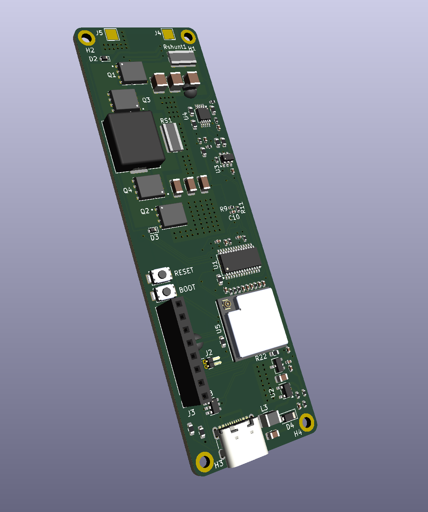
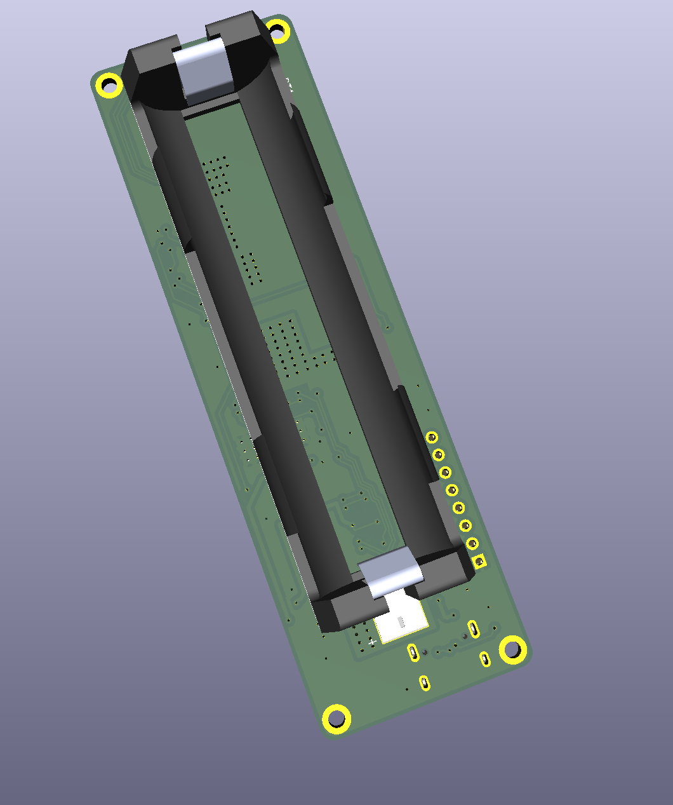
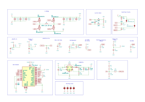
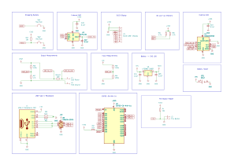

# Helix Vape — Power Board

KiCad hardware design for the **Helix** temperature-control vape mod: a single-cell, USB-C powered board capable of delivering **1.0–10 V at up to 80 W** into a heating coil, with closed-loop current/voltage sensing and an ESP32-C6 running the [Helix-FW](https://github.com/stevensun369/helix-vape-fw) firmware.

The power stage is based on TI's **PMP20410** reference design, re-implemented and integrated with the MCU, sensing, and user-interface circuitry on a single board.

## Renders

| Front | Back |
|-------|------|
|  |  |

## Schematics

| Power & analog front-end | MCU & digital |
|--------------------------|---------------|
| [](images/helix_vape.svg) | [](images/mcu.svg) |

> Click either schematic to open the full-size SVG.

## How It Works

The board is a **digitally-controlled buck-boost regulator**. The MCU sets a target output via a DAC that injects into the regulator's feedback node, the ADC measures the actual coil current and voltage, and the firmware closes the loop with a PID controller. Because the regulator both bucks and boosts, it can hold a precise output regardless of where the battery sits in its discharge curve.

```
USB-C / Battery ──► LM5175 Buck-Boost ──► Q1–Q4 Power FETs ──► Coil
                         ▲                        │
                    MCP4726 DAC          RS1 / Rshunt sense
                         │                        │
                    ESP32-C6 ◄──────── ADS1015 ADC
```

## Key Components

| Ref | Part | Function |
|-----|------|----------|
| U1 | **LM5175PWP** | 4-switch synchronous buck-boost controller — the main 80 W power stage |
| U5 | **ESP32-C6-MINI-1U** | RISC-V MCU + Wi-Fi/BLE module; runs the control loop, UI, and safety logic |
| U4 | **ADS1015IDGS** | 12-bit I²C ADC — differential coil-current sensing plus single-ended Vout/Vbat |
| U3 | **MCP4726** | 12-bit I²C DAC — injects into the LM5175 feedback node to set output (inverse scaling) |
| Q1–Q4 | **BSC010NE2LSI** | 25 V, ~1 mΩ power MOSFETs — the buck-boost switching bridge |
| U2 | **LMR62014XMF** | Boost regulator for the auxiliary/gate-drive rail |
| U6 | **LP3986-30B3F** | 3.0 V LDO — clean rail for the MCU and analog parts |
| U8 | **USBLC6-2SC6** | USB-C data-line ESD / TVS protection |
| J1 | **USB-C Receptacle (16P)** | Charging and power input |
| RS1 / Rshunt1 | **2 mΩ / 10 mΩ shunts** | High-side and coil current sensing |
| L1 | **680 nH, 23 A** | Main power inductor (Chilisin) |
| BT1 | **1042 cell** | Battery connection |
| SW1 / SW2 | Push buttons | User input |

Full bill of materials with LCSC part numbers is in [`PRODUCTION_FILES/BOM-helix_vape.csv`](PRODUCTION_FILES/BOM-helix_vape.csv).

## Design Notes

- **Inverse DAC feedback:** higher DAC voltage produces *lower* output, so any logical fault or DAC reset biases the regulator toward a safe low-power idle (~1.0 V) rather than full power.
- **Shared I²C bus @ 400 kHz** ties together the ADC and DAC; the firmware arbitrates access to keep latency predictable under contention.
- **Differential current sensing** through the ADS1015 gives the firmware accurate, real-time coil current for PID power control and over-current safety.

## Files

| Path | Contents |
|------|----------|
| `helix_vape.kicad_pro` / `.kicad_sch` / `.kicad_pcb` | KiCad project, schematics, and board layout |
| `mcu.kicad_sch` | MCU subsheet |
| `PRODUCTION_FILES/` | Gerbers, BOM, and CPL (pick-and-place) for JLCPCB |
| `jlcpcb/` | JLCPCB fabrication / assembly outputs |
| `images/` | 3D renders and exported schematics |

## Manufacturing

Production files target **JLCPCB** assembly:

- `PRODUCTION_FILES/GERBER-helix_vape.zip` — fabrication Gerbers
- `PRODUCTION_FILES/BOM-helix_vape.csv` — bill of materials (LCSC part numbers)
- `PRODUCTION_FILES/CPL-helix_vape.csv` — component placement / pick-and-place

## Firmware

The board is driven by [Helix-FW](https://github.com/stevensun369/helix-vape-fw), an async Rust (Embassy) firmware with a host-testable safety and control logic core.
